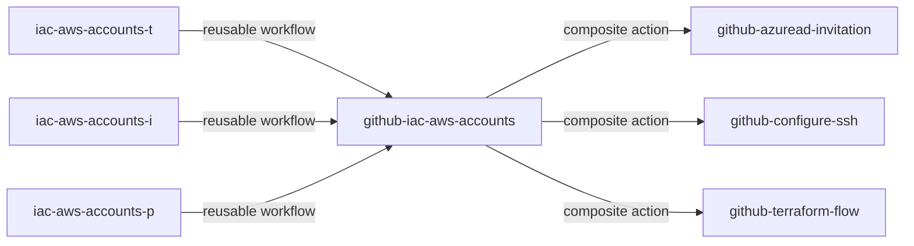
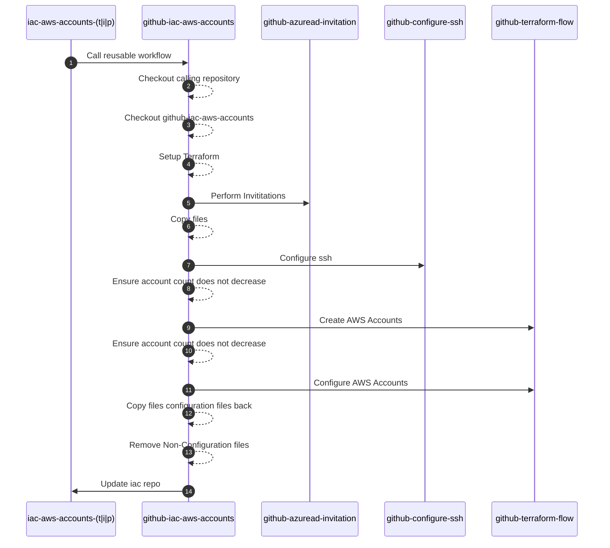

# github-iac-aws-accounts
Github reusable workflow (iac-aws-accounts.yml) and composite action (action.yml) to create AWS Accounts

# Relation between Github Repos

```mermaid
flowchart LR
    id_t[iac-aws-accounts-t] --reusable workflow-->  id_rw[github-iac-aws-accounts]
    id_i[iac-aws-accounts-i] --reusable workflow-->  id_rw
    id_p[iac-aws-accounts-p] --reusable workflow-->  id_rw
    id_rw --composite action--> id_invite[github-azuread-invitation]
    id_rw --composite action--> id_ssh[github-configure-ssh]
    id_rw --composite action--> id_terraform[github-terraform-flow]
```

# Sequence

```mermaid
sequenceDiagram
    autonumber
    participant id_iac as iac-aws-accounts-(t|i|p)
    participant id_rw as github-iac-aws-accounts
    participant id_invite as github-azuread-invitation
    participant id_ssh as github-configure-ssh
    participant id_terraform as github-terraform-flow
    id_iac ->>  id_rw: Call reusable workflow
    id_rw -->> id_rw: Checkout calling repository
    id_rw -->> id_rw: Checkout github-iac-aws-accounts
    id_rw -->> id_rw: Setup Terraform
    id_rw ->> id_invite: Perform Invititations
    id_rw -->> id_rw: Copy files
    id_rw ->> id_ssh: Configure ssh
    id_rw -->> id_rw: Ensure account count does not decrease
    id_rw ->> id_terraform: Create AWS Accounts
    id_rw -->> id_rw: Ensure account count does not decrease
    id_rw ->> id_terraform: Configure AWS Accounts
    id_rw -->> id_rw: Copy files configuration files back
    id_rw -->> id_rw: Remove Non-Configuration files
    id_rw ->> id_iac: Update iac repo
```