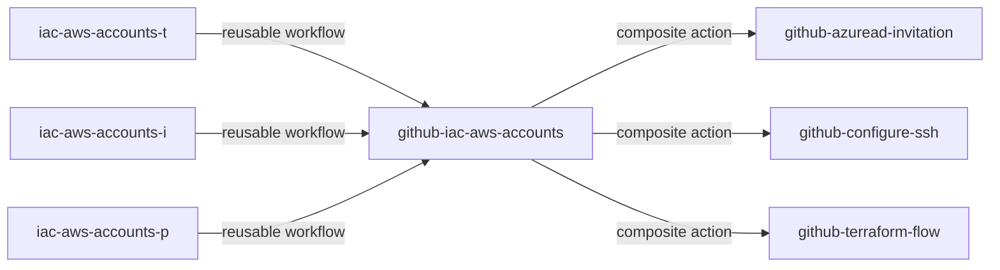

# github-iac-aws-accounts
Github reusable workflow (iac-aws-accounts.yml) and composite action (action.yml) to create AWS Accounts

# Relation between Github Repos

# Github Workflow Sequence

# Terraform
The Terraform implementation relies on three parts of the calling repository:
* the file *./iac-aws-accounts/creation/accounts.tf* which contains details about the AWS Accounts that should be managed.
* the folder *environment* which contains tfvars files for both backend configuration and plan/apply variables for both AWS Account creation and configuration.

## Perform Invititations
The GitHub composite action call *Perform Invitations* relies on the file *./iac-aws-accounts/creation/accounts.tf*. The action ensure that each user mentioned in the file as owner of an AWS account is invited to current Azure AD tenant.

## Create AWS Accounts
The Terraform files in folder *creation* (from this repository) together the file *./iac-aws-accounts/creation/accounts.tf* (from the calling repository) cover the creation of AWS Accounts via Terraform module *bit-csb/terraform-aws-account-creation*. In addition to that a configuration file for each AWS Account is generated and stored in the folder *configuration*.

## Configure AWS Accounts
The Terraform files in folder *configuration* (from this repository) together the files from the previous creation step cover the configuration of each AWS Account via the Terraform Module *bit-csb/terraform-aws-account-configuration*.
